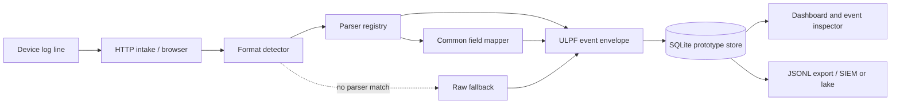

# ULPF prototype — architecture summary

## Purpose

Convert heterogeneous perimeter-device logs into a common event envelope while retaining the exact submitted event text for forensic review and compliance. Unknown formats remain searchable raw events instead of being dropped.

## Processing flow

## Event envelope and lineage

Each stored record includes `schema_version`, unique `event_id`, event timestamps, category/action/outcome/severity/code, source vendor/product/device/process/format, source and destination endpoints, network protocol/application, principal and rule fields, and a message. `normalization` records the parser and version, status (`normalized`, `partial`, or `unparsed`), input-to-canonical field mappings, and remaining parsed attributes. `raw` stores the original UTF-8 text and SHA-256 digest. The stable event ID ties the UI, normalized representation, raw download, and export together. The prototype does not discard extra parsed fields or deduplicate submitted events.

## Extensibility and deployment

Built-in adapters detect JSON, CEF, LEEF, and Syslog. A local Python plug-in registers a detector and parser under `parsers/`; the generic fallback handles unknown lines. The service and UI use Python's standard library, SQLite, and local static assets. It can run with a local Python install or in a container. No runtime internet access is needed; container image transfer can use an offline image archive.

## Production scale path

The prototype's single-process SQLite store is intended for a local demo and does not meet a billions-of-events-per-day target. A scaled deployment can preserve the envelope and parser plug-in contract while replacing intake/storage with partitioned collectors, a durable queue (for example, Kafka-compatible), horizontally scaled stateless parser workers, and a partitioned object-store/data-lake sink. Backpressure, retries, schema governance, access control, encryption, retention, and SIEM-specific delivery would be production deployment concerns.
